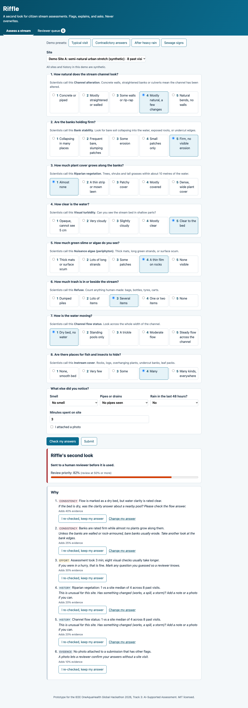

# Riffle

A second look for citizen stream assessments. Riffle checks a volunteer's visual stream assessment before it is submitted, explains anything that looks off in plain language, asks the volunteer to re-check, and routes doubtful or health-relevant reports to a human reviewer. It never changes an answer. Output is an HL7 FHIR R4 Bundle whose `Observation.status` records the human decision.

Built for the IEEE OneAquaHealth Global Hackathon 2026, **Track 3: AI-Supported Assessment**.

**Live demo:** https://mavedam.github.io/riffle/ (use the demo presets at the top of the page)



## Run it

No build step, no dependencies, no API keys.

```bash
python3 -m http.server 8080      # or: npm start
# open http://localhost:8080
npm test                          # Node 20+; 14 tests
```

ES modules do not load from `file://`, so open it through a local server or GitHub Pages (Settings → Pages → deploy from `main`, root).

Demo presets at the top of the page reproduce the four video scenarios.

## How it works

```
citizen answers ──► engine.validate(assessment, siteHistory, confirmed)
                      ├─ consistency rules     (4 hand-written, physically motivated)
                      ├─ effort signals        (straight-lining, < 4 min on site)
                      ├─ site-history outliers (modified z > 3.5 AND jump ≥ 2 points, ≥ 5 past visits)
                      ├─ context               (rain in last 48 h softens clarity/flow outliers)
                      └─ evidence              (no photo, only when something else fired)
                    ──► priority = 1 − ∏(1 − wᵢ)   (noisy-OR, every wᵢ shown to the user)
                    ──► accept (< 0.2) | accept with note | human review (≥ 0.5)
                    ──► One Health notes (sewage, chemical, bloom) → human follow-up
                    ──► fhir.toBundle() → Location + 12 Observations + Provenance
```

| File | Role |
|---|---|
| `src/protocol.js` | 8 metrics on a 1–5 scale, plain-language question, scientific term, help text |
| `src/engine.js` | Pure validation functions. No network. Never mutates input. |
| `src/fhir.js` | FHIR R4 export. Reviewer state → `preliminary` / `final` / `entered-in-error`. Provenance agents: citizen `performer`, Riffle `assembler`, reviewer `verifier`. |
| `src/app.js` | Accessible single-page UI, reviewer queue, localStorage persistence |
| `src/sample-data.js` | **Synthetic** site histories for the demo |
| `docs/sample-bundle.fhir.json` | A real export from the app after reviewer approval |

## Responsible-AI choices

- **Human judgment wins.** A citizen who re-checks and keeps an answer halves that flag's weight; the flag stays on record. Only a reviewer can approve or reject, and rejection requires a written reason. Rejected data is marked `entered-in-error`, not deleted.
- **Explainable by construction.** Every flag shows its message, its prompt, and its exact contribution to the priority score.
- **No false reassurance.** Visual scores track physical habitat, not water quality ([McMurray et al., 2026](https://doi.org/10.1371/journal.pone.0351972)). Health notes are precautions plus a measurement suggestion, never "safe" or "unsafe".
- **Data quality and health risk are separate.** A trustworthy sewage report still needs a person to act, so it enters the queue even with a low priority score.

## Limitations

- The weights and thresholds are hand-set, not learned. There was no labeled set of "correct vs. wrong" citizen assessments to train or calibrate on. Calibrating against expert re-surveys is the first job for a pilot.
- The demo protocol is modeled on public visual assessment protocols. It is not the OneAquaHealth Citizen Science App schema.
- Site histories are synthetic. Data is stored in the browser only; there is no backend, login, or access control. Any real deployment needs authentication for reviewers and pseudonymous citizen IDs.
- The FHIR code system (`urn:riffle:codesystem:visual-stream-assessment`) is local. No standard terminology exists for these stream metrics yet.

## Next

1. Map `protocol.js` to the OneAquaHealth Citizen Science App fields.
2. Calibrate weights against paired citizen/expert assessments.
3. POST bundles to a FHIR server (HAPI sandbox) instead of downloading them.
4. Photo-based checks as a further, still-advisory signal.

## License

MIT © 2026 Manonmayi Vedam
